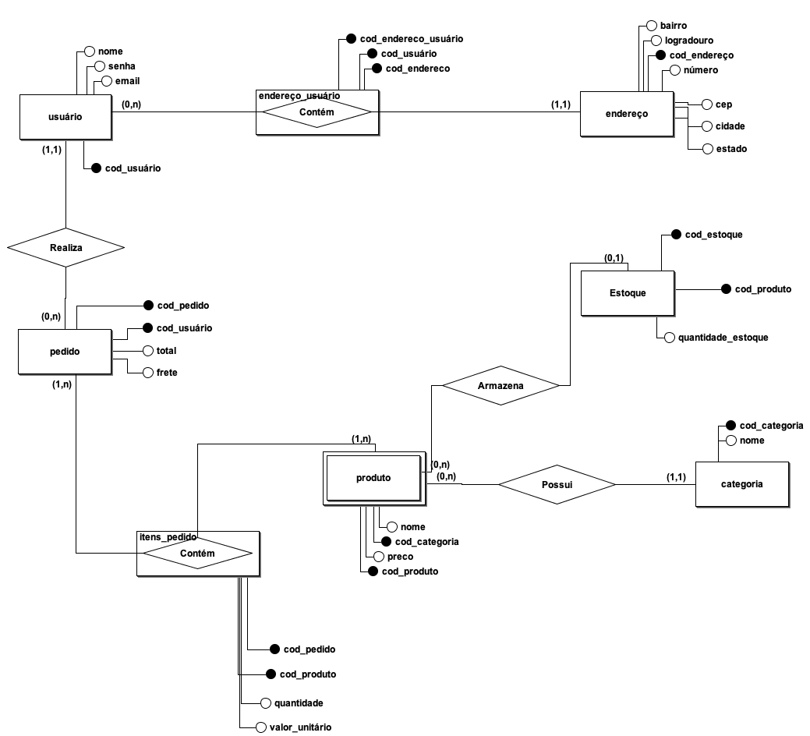

<h1> Arquitetura e desempenho de banco de dados </h1>

## Sobre o projeto

Este projeto tem como objetivo trabalhar com dados estruturados por meio da linguagem SQL. A proposta é um ecommerce especializado na venda de produtos cosméticos. O banco de dados será projetado para gerenciar as informações relacionadas aos produtos, clientes, pedidos, pagamentos, estoque e promoções. Considerando a natureza dinâmica do setor de cosméticos, é necessário que o banco de dados seja flexível e escalável para acomodar novos produtos.

---

### Modelo conceitual do banco de dados

---

### Modelo lógico do banco de dados

---

