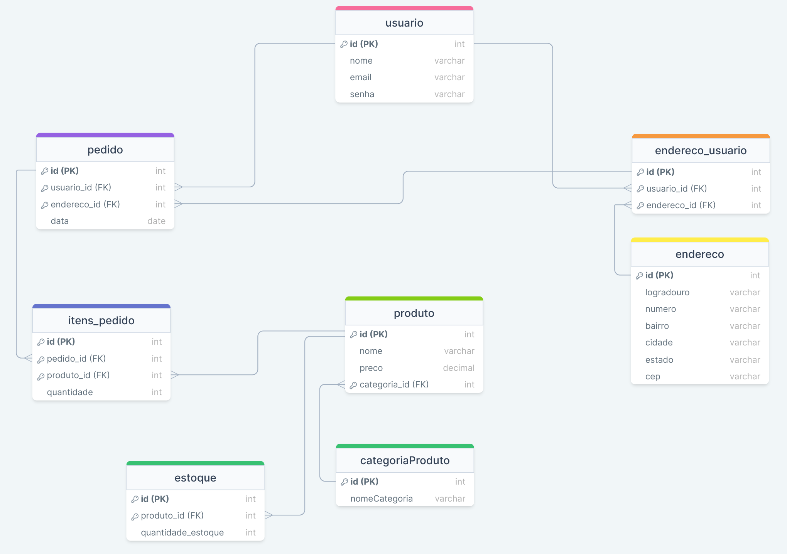

<h1> Arquitetura e desempenho de banco de dados </h1>

## Sobre o projeto

Este projeto tem como objetivo trabalhar com dados estruturados por meio da linguagem SQL. Derivado de um projeto da disciplina Sistemas Distribuídos, esse projeto tem como objetivo construir um banco de dados utilizando os conceitos aprendidos em sala de aula como a criação de consultas, funções e a utilização de gatilhos (triggers) para automatizar determinadas ações. A proposta é o desenvolvimento de um e-commerce de diversos produtos. O banco de dados será projetado para gerenciar as informações relacionadas aos produtos, clientes, pedidos e estoque. Considerando a natureza dinâmica do setor de vendas, é necessário que o banco de dados seja flexível e escalável para acomodar novos produtos.

Para atingir esse objetivo, serão aplicadas práticas de modelagem de dados eficientes, considerando relações entre entidades, normalização e integridade referencial. O uso de triggers permitirá a automação de ações específicas, como a atualização automática de estoque após a realização de um pedido ou a verificação de idade durante o cadastro de um cliente.

A seguir, serão apresentados os modelos conceitual e lógico deste projeto, delineando as estruturas que compõem o sistema de gerenciamento de e-commerce.

---

### Modelo conceitual do banco de dados

---

### Modelo lógico do banco de dados

---

### Executando o projeto

- Para executar o projeto siga as etapas:

  1. Execute o arquivo `ScriptCriarTabelas.sql` para criar as tabelas do banco de dados.
  2. Execute o arquivo `ScriptPreencherTabelas.sql` para preencher as tabelas com dados.
  3. Execute o arquivo `ScriptCriarFuncoes.sql` para criar algumas Funções e Triggers.
  4. Abra o arquivo `Queries.sql` para executar algumas queries de teste.